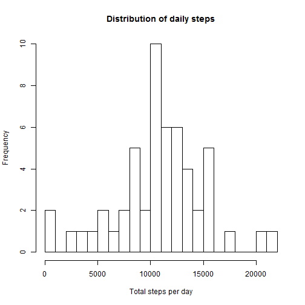
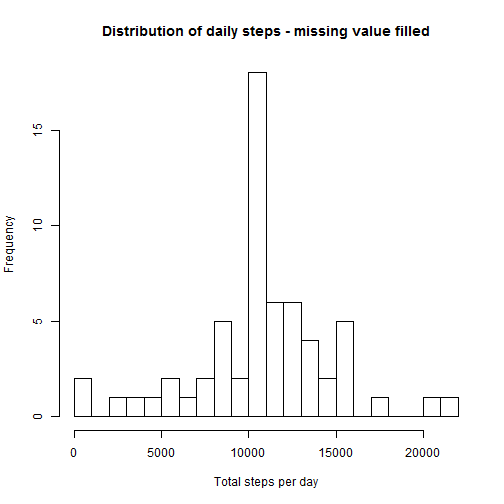
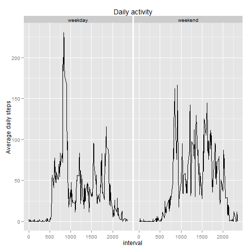

# Reproducible Research: Peer Assessment 1

========================================================================================  
  
## 1. Loading and preprocessing the data  
  
#### __Note: Transform "date" from factor to Date variable__

```r
data <- read.csv("activity.csv")
library(dplyr)
data <- mutate(data, date=as.Date(data$date))
```
========================================================================================  
  
## 2. What is mean total number of steps taken per day?  
#### __First, we calculate the total number of steps per day.__

```r
totalstepbydate <- data %>%
        filter(!is.na(steps)) %>%
        group_by(date) %>%
        summarise(totalstep=sum(steps,na.rm=TRUE))
```
  
#### __2.1. Make a histogram of total number of steps each day:__

```r
hist(totalstepbydate$totalstep,breaks=30,xlab="Total steps per day", main="Distribution of daily steps")
```

 
  
  
#### __2.2. Calculate and report the mean and median total number of steps taken per day__
__First we calculate the mean and median value of daily steps:__

```r
meantotalstep <- as.integer(round(mean(totalstepbydate$totalstep)))
mediantotalstep <- median(totalstepbydate$totalstep)
```

##### _Therefore, the mean value of daily total steps is 10766, the median value is 10765._
  
  
  
========================================================================================  
  
## 3. What is the average daily activity pattern?
__First we calculate the average of daily steps over the 5-min interval:__

```r
avgintervalstep <- data %>%
        group_by(interval) %>%
        summarise(avgstep=mean(steps,na.rm=TRUE))
```
#### __3.1. Make a time series plot of average daily steps per interval:__

```r
with(avgintervalstep,
     plot(interval,avgstep,type='l',xlab='Interval',ylab='Average steps')
)
```

 
  
  
#### __3.2. Which time interval is the most active?__
__Find the time interval containing maximum step number:__

```r
maxactivity <- avgintervalstep$interval[which.max(avgintervalstep$avgstep)]
```
##### _Therefore, on average the user takes the maximum number of steps in time interval 835._

========================================================================================  
  
## 4. Imputing missing values
#### __4.1. Calculate the total number of missing values. __

```r
totalna <- sum(is.na(data$steps))
```
##### _Therefore, the total number of missing values is 2304._
  
  
#### __4.2-4.3. Fill in the missing values, here I am using the mean of the 5-min interval as the estimate. Create another dataset with the missing values filled in. __

```r
data2 <- data %>%
        merge(avgintervalstep,by.x="interval",all=TRUE) %>%
        filter(is.na(steps)) %>%
        mutate(steps=avgstep) %>%
        select(steps,date,interval) %>%
        rbind_list(data[!is.na(data$steps),]) %>%
        arrange(date)
```

#### __4.4. Make histogram of total steps each day, report mean and median value, and the impact of filling missing data. __

```r
# First we calculate the total steps each day.
totalstepbydate2 <- data2 %>%
        filter(!is.na(steps)) %>%
        group_by(date) %>%
        summarise(totalstep=sum(steps,na.rm=TRUE))

# Then we make the histogram:
hist(totalstepbydate2$totalstep,breaks=30,xlab="Total steps per day", main="Distribution of daily steps - missing value filled")
```

 

```r
# Calculate mean and median values:
meantotalstep2 <- as.integer(round(mean(totalstepbydate2$totalstep)))
mediantotalstep2 <- as.integer(round(median(totalstepbydate2$totalstep)))
```
##### _Therefore, after filling in missing vaues, the mean value of daily total steps is 10766, the median value is 10766._  
  
  

```r
# Find impact of filling missing values:
impactmean <- ""
impactmedian <- ""
impactdailystep <- ""

if (meantotalstep==meantotalstep2) {
        impactmean <- "the same"
} else {
        impactmean <- "different"
}

if (mediantotalstep==mediantotalstep2) {
        impactmedian <- "the same"
} else {
        impactmedian <- "different"
}

if (sum(dim(totalstepbydate)-dim(totalstepbydate2))==0) {
        impactdailystep <- "the same"
} else {
        impactdailystep <- "different"
}
```
##### _Therefore, after filling in missing vaues, the mean value of daily total steps is the same, the median value is different, and the total daily steps is different._  
  
  
========================================================================================  
  
## 5. Are there differences in activity patterns between weekdays and weekends?
#### __5.1. Create new factor variable indicating it's weekday or weekend. __

```r
data2 <- data2 %>%
        mutate(wd=weekdays(date),wday="")
data2$wday[data2$wd %in% c("Saturday","Sunday")] <- "weekend"
data2$wday[!data2$wd %in% c("Saturday","Sunday")] <- "weekday"
data2 <- data2 %>%
        select(-wd) %>%
        mutate(wday=as.factor(wday))
```
__Check the data set now:__

```r
head(data2)
```

```
##     steps       date interval    wday
## 1 1.71698 2012-10-01        0 weekday
## 2 0.33962 2012-10-01        5 weekday
## 3 0.13208 2012-10-01       10 weekday
## 4 0.15094 2012-10-01       15 weekday
## 5 0.07547 2012-10-01       20 weekday
## 6 2.09434 2012-10-01       25 weekday
```
  
#### __5.2. Create time series plot of average steps, separating weekday or weekend. __  

```r
# First, calculate average steps over days, separating weekday/weekends
avgintervalstep2 <- data2 %>%
        group_by(wday,interval) %>%
        summarise(avgstep=mean(steps))

# Then, plot the results
library(ggplot2)
g <- ggplot(avgintervalstep2,aes(x=interval,y=avgstep))
g+facet_grid(.~wday)+geom_line()+labs(y="Average daily steps")+labs(title="Daily activity")
```

 
  
    
## This is the end of the report.


